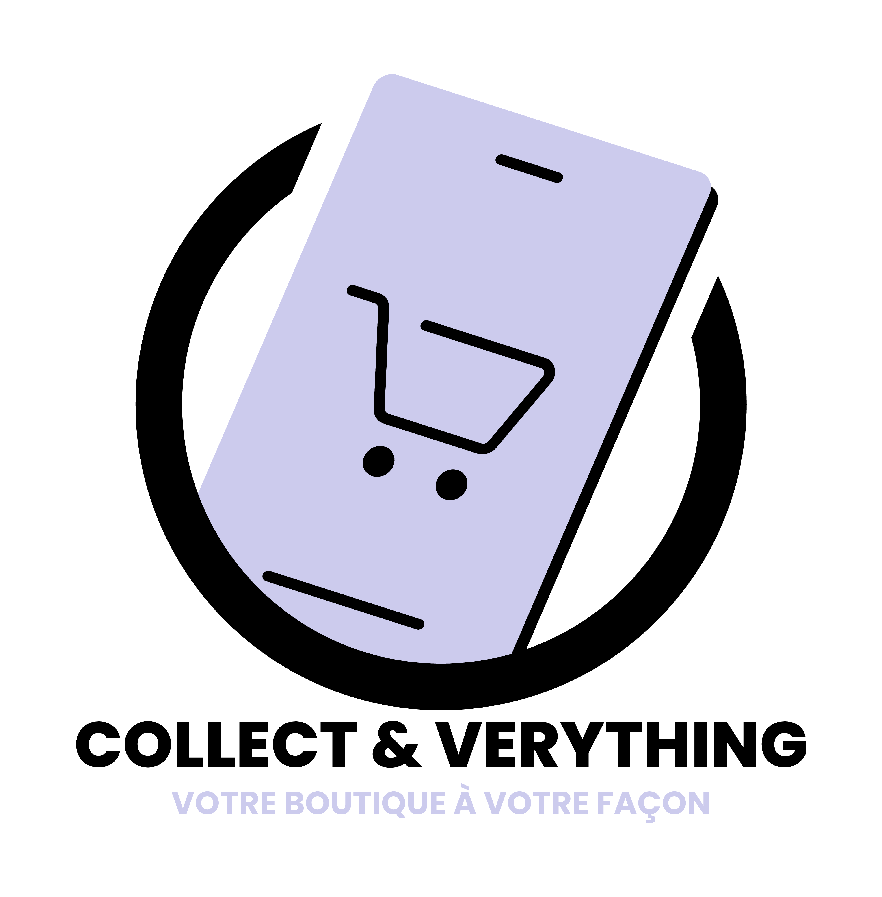

<br />
<div align="center">
  <a href="https://github.com/Collect-Verything/">
    
  </a>

<h3 align="center">Collect & Verything</h3>

  <p align="center">
    <a href="https://github.com/Collect-Verything">Request Feature</a>
  </p>
</div>


<!-- TABLE OF CONTENTS -->
<details>
  <summary>Table of Contents</summary>
  <ol>
    <li>
      <a href="#about-the-project">About The Project</a>
      <ul>
        <li><a href="#Features">Features</a></li>
        <li><a href="#built-with">Built With</a></li>
      </ul>
    </li>
    <li>
      <a href="#getting-started">Getting Started</a>
      <ul>
        <li><a href="#prerequisites">Prerequisites</a></li>
        <li><a href="#installation">Installation</a></li>
      </ul>
    </li>
    <li><a href="#contributing">Contributing</a></li>
    <li><a href="#license">License</a></li>
    <li><a href="#contact">Contact</a></li>
    <li><a href="#acknowledgments">Acknowledgments</a></li>
  </ol>
</details>


<!-- ABOUT THE PROJECT -->
## About The Project

This project was undertaken as a personal study and research. Please note that some components may not be aligned with best practices. I draw the attention of those considering using this project for commercial purposes to this consideration.

I'm open to any tips, tricks, or warnings you might have to share, in the interest of further enriching this project.

As part of this project, my goal is to implement the essential functionalities of a modern online store. Here are the features I plan to implement:

<!-- FEATURES -->

## Features

### Basic features:

- **Product catalog**: Clear display of products with detailed information.

- **Shopping cart**: Easy addition, modification and deletion of products in the cart.

- **Ordering process**: Simple and intuitive ordering steps.

- **Secure payment options**: Integration of secure online payment methods: Visa & paypal with stripe.

- **Order management system**: Order tracking, invoice, transaction history & PDF Export.

- **User management**: Registration, connection, and management of user accounts.

- **Admin Filtering and Search**: Advanced search features and filters to help users find user quickly.

- **Rating and Review System**: Allows customers to leave comments and ratings on products.

- **Notifications**: Email alerts or push notifications for order updates, promotions, etc.

- **Multi-language Support**: English, Spanish, French, German, Mandarin, Japanese, Arabic, Portuguese, Russian, Hindi, Japanese.

- **Light/Dark mode**: Customizing the UI.

- **Mail Alert** : On registration, forgot password, news letter & invoice confirmation.


### Little extras:

- **Loyalty Program**: Rewards for loyal customers.

- **Register/Login** : With Google.

- **Personalized Recommendations**: Product suggestions based on purchase history.

- **Social Media Integration**: Easy sharing of products on social media.

- **Live**: Real-time chat support to answer customer questions, alert.

- **Flexible Shipping Options**: Choice of different shipping options and real-time tracking.

- **FAQ Page**: Answers to frequently asked questions.

- **Affiliate Programs**: Allows users to earn commissions by recommending products.

- **Flash sales and promotions**: Special offers and temporary discounts.

- **Mobile application**: Mobile version of the site or dedicated application.


<p align="right">(<a href="#readme-top">back to top</a>)</p>

<!-- BUILT WITH -->
### Built With

* [![NestJs][NestJs]][Next-url]
* [![Prisma][Prisma]][Prisma-url]
* [![Docker][Docker]][Docker-url]
* [![MySql][MySql]][MySql-url]
* [![React][React.js]][React-url]
* [![Npm][Npm]][Npm-url]
* [![Mui][Mui]][Mui-url]

<p align="right">(<a href="#readme-top">back to top</a>)</p>


<!-- GETTING STARTED -->
## Getting Started

### Prerequisites

Once the application is closed it is necessary to install the root dependencies
  ```sh
  npm i
  ```

It is then necessary to install the dependencies of each application/microservice, to do this you must execute the following command in root:
```sh
npm run install-all
  ```
  
### Auth service

To lunch only the auth service, read the [Auth Read Me][Auth Read.Me]


<p align="right">(<a href="#readme-top">back to top</a>)</p>


<!-- CONTRIBUTING -->
## Contributing

If you have a suggestion that would make this better, please fork the repo and create a pull request. You can also simply open an issue with the tag "enhancement".
Don't forget to give the project a star! Thanks again!

1. Fork the Project
2. Create your Feature Branch (`git checkout -b feature/AmazingFeature`)
3. Commit your Changes (`git commit -m 'Add some AmazingFeature'`)
4. Push to the Branch (`git push origin feature/AmazingFeature`)
5. Open a Pull Request

<p align="right">(<a href="#readme-top">back to top</a>)</p>


<!-- LICENSE -->
## License

Distributed under the Creative Commons Legal Code License. See `LICENSE.txt` for more information.

<p align="right">(<a href="#readme-top">back to top</a>)</p>


<!-- CONTACT -->
## Contact

Canse - Link: [Github](https://github.com/CanseFr)

Baptiste - Link: [Github](https://github.com/titoon57)

Thomas - Link: [Github](https://github.com/ThomasStibling)

Ishak - Link: [Github](https://github.com/Ishak-rav)


<p align="right">(<a href="#readme-top">back to top</a>)</p>


<!-- MARKDOWN LINKS & IMAGES -->
<!-- https://www.markdownguide.org/basic-syntax/#reference-style-links -->
[NestJs]: https://img.shields.io/badge/nestJs-000000?style=for-the-badge&logo=nextdotjs&logoColor=white
[Next-url]: https://nextjs.org/
[React.js]: https://img.shields.io/badge/React-000000?style=for-the-badge&logo=react&logoColor=61DAFB
[React-url]: https://reactjs.org/
[Vite]: https://img.shields.io/badge/Vite-000000?style=for-the-badge&logo=vite&logoColor=e6d92e
[Vite-url]: https://vitejs.dev/
[Turbo]: https://img.shields.io/badge/Turbo-000000?style=for-the-badge&logo=turbo&logoColor=d93dc7
[Turbo-url]: [https://vitejs.dev/](https://turbo.build/)https://turbo.build/
[Prisma]: https://img.shields.io/badge/Prisma-000000?style=for-the-badge&logo=prisma&logoColor=8052ab
[Prisma-url]: https://www.prisma.io/
[MySql]: https://img.shields.io/badge/MySql-000000?style=for-the-badge&logo=MySql&logoColor=de7a16
[MySql-url]: https://www.mysql.com/fr/
[Docker]: https://img.shields.io/badge/Docker-000000?style=for-the-badge&logo=Docker&logoColor=150c91
[Docker-url]: https://www.docker.com/
[Npm]: https://img.shields.io/badge/Npm-000000?style=for-the-badge&logo=Npm&logoColor=ed0000
[Npm-url]: https://www.npmjs.com/
[Mui]: https://img.shields.io/badge/Mui-000000?style=for-the-badge&logo=Mui&logoColor=3d4ee3
[Mui-url]: https://www.npmjs.com/

[Auth Read.Me]: auth-service/README.md