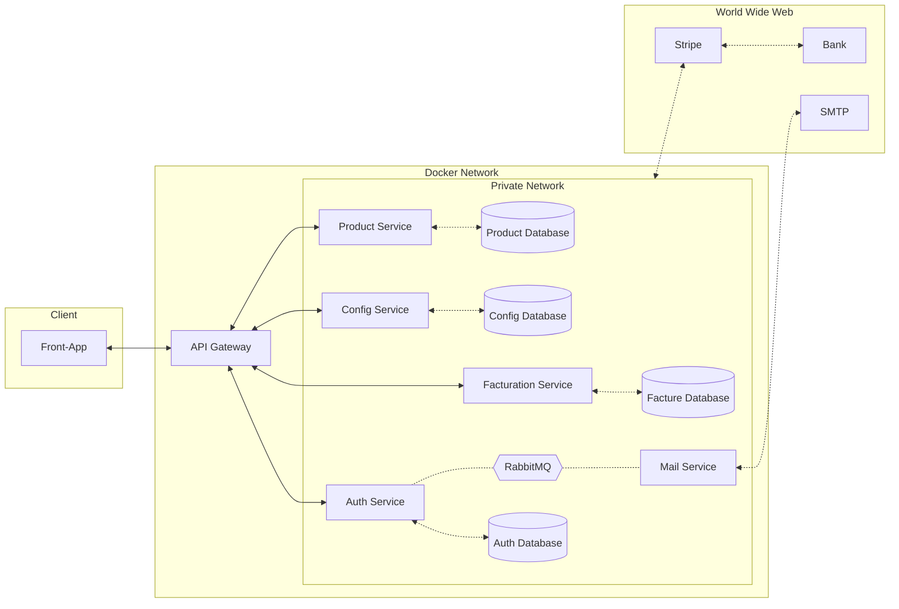

← [Retourner au sommaire] [summary]

# Application

* Chaque service communique avec l'API de Stripe. Pour des raisons de lisibilité, le réseau privé (Private Network) a été relié à l'API de Stripe, plutôt que de représenter une connexion individuelle depuis chaque service.

[summary]: ../../README.md
