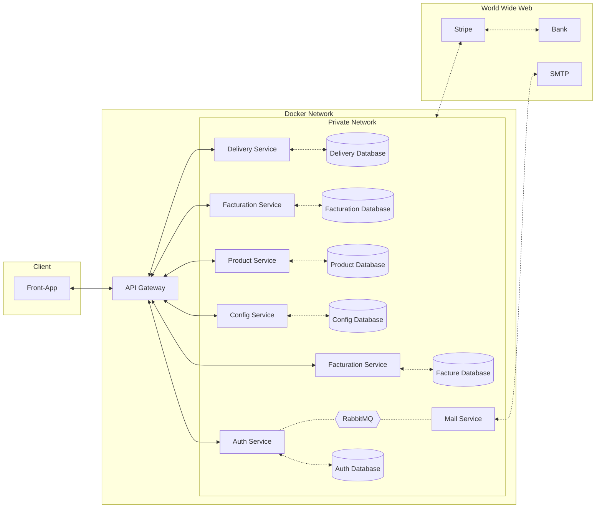

← [Retourner au sommaire] [summary]

# Application

- Le réseau privé (Private Network) a été relié à l'API de Stripe, plutôt que de représenter une connexion individuelle depuis chaque service.
- Tous les autre service qui communique avec le message broker n'ont pas etait representé pour des question de lisibilité mais sont consultable dans workflow/stripe/events

[summary]: ../../README.md
