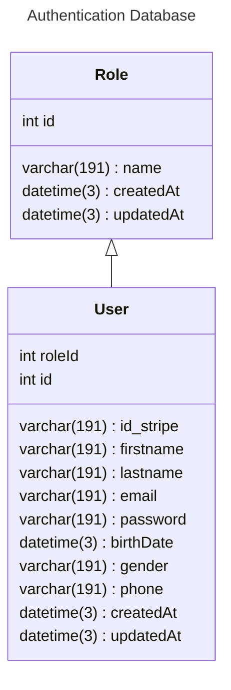

← [Retourner au sommaire] [summary]

# Auth Database

La base de données d’authentification (_Auth Database_) est liée à la gestion des rôles. Ces rôles sont définis de la manière suivante :

- **USER** : Ce rôle est attribué automatiquement lors de l’inscription d’un nouveau client. Il peut également être modifié par un **SUPER_ADMIN** via l’interface d’administration des utilisateurs.
- **SUPER_ADMIN** : Ce rôle est défini dès la configuration initiale d’une souscription. L’utilisateur associé à ce rôle est précisé dans le fichier de configuration lors du déploiement de l’application client. Son adresse e-mail et son rôle sont automatiquement injectés dans la base de données via un script de _seed_.
- **JOB** : Les autres rôles dits "métiers" sont créés et assignés par le **SUPER_ADMIN** via l’interface de gestion du personnel. Ces rôles sont associés à des permissions spécifiques selon leur fonction.

## Spécification des champs

La table user possède un champ id_stripe, car il est nécessaire d’effectuer des requêtes vers le service de facturation (Stripe). Cela facilite certaines interactions liées au paiement, comme la récupération des factures ou de données spécifiques dans certains services, en utilisant cet identifiant.

---

# Rôles

Les rôles sont principalement définis par le **SUPER_ADMIN**, à l’exception de :

- **USER**, attribué automatiquement à l’inscription ;
- Les rôles **JOB**, créés manuellement par le **SUPER_ADMIN** selon les besoins métiers.

## Description des rôles

- **JOB** : Rôle métier attribué à des utilisateurs ayant un accès limité à certaines fonctionnalités spécifiques. Par exemple :

  - Un rôle `INVOICE` n’accède qu’à la gestion des factures ;
  - Un rôle `SUPPORT` accède uniquement au module de support client ;
  - D’autres rôles peuvent être ajoutés selon les besoins.

- **USER** : Rôle client standard. Ces utilisateurs accèdent uniquement aux fonctionnalités prévues pour eux : configuration de produits, consultation des factures, accès au support, etc.

---

## Rôles actuellement définis

L’application étant encore en cours de développement, les rôles actuellement disponibles sont :

- `SUPER_ADMIN`
- `USER`
- `INVOICE`
- `SUPPORT`

[summary]: ../../README.md
