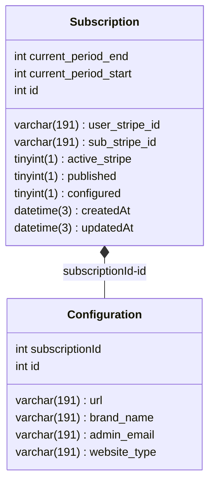

← [Retourner au sommaire] [summary]

# Configuration Database

Le service de configuration est d'abord représenté par une souscription, puis une souscription peut ensuite être configurée.

[summary]: ../../README.md
