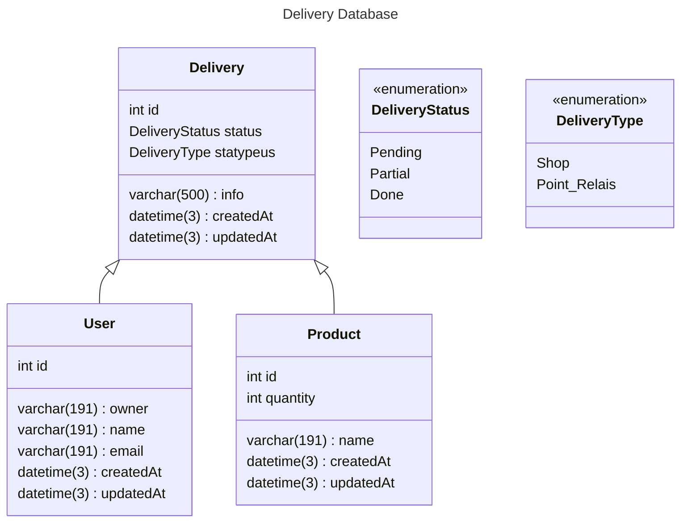

← [Retourner au sommaire] [summary]

# Delivery Database

La base de données Delivery-Service gère l’enregistrement et le suivi de tous les événements de livraison de commandes. Elle doit pouvoir traiter deux scénarios principaux :

Livraison en point relais : simple notification pour indiquer qu’une commande est disponible en point relais pour un client et les produits concernés.

Livraison en magasin : persistance de la commande (produits, quantités) avec suivi du statut de livraison au client.

[summary]: ../../README.md
