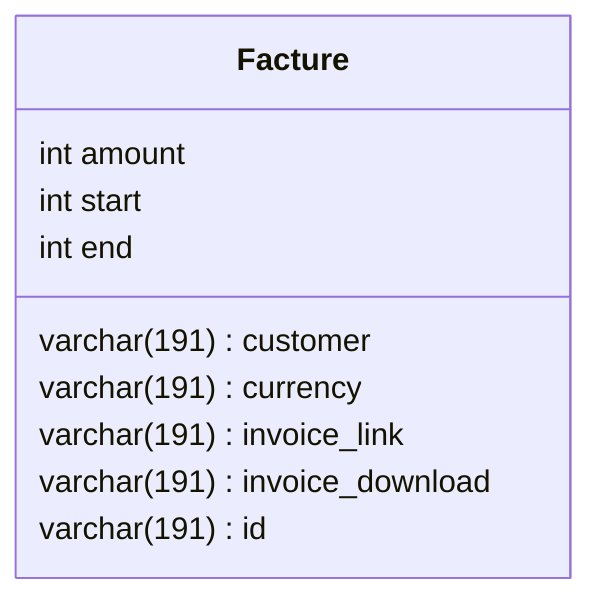

← [Retourner au sommaire] [summary]

# Facturation Database

```mermaid
classDiagram
direction BT
class Facture {
   int amount
   varchar(191) customer
   varchar(191) currency
   varchar(191) invoice_link
   varchar(191) invoice_download
   int start
   int end
   varchar(191) id
}
```

[summary]: ../README.md
