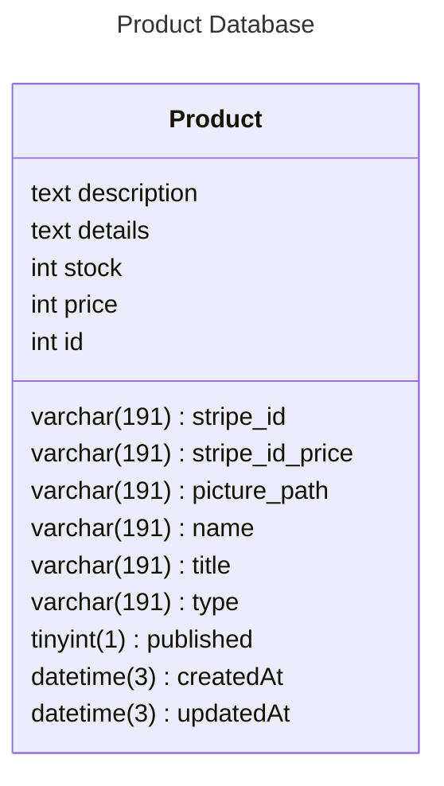

← [Retourner au sommaire] [summary]

## Spécification des champs

La table produit possède deux champs particuliers : l'ID produit Stripe et l'ID prix Stripe, sachant que dans ce contexte, les prix et les produits sont deux entités différentes.

### Strip_Id_Price
Quand le prix d'un produit change, un nouvel ID produit lui est affilié. Cependant, par exemple, si un client a acheté un abonnement il y a un an et qu'entre-temps le produit a augmenté de prix, le client sera facturé avec l'ID prix qui était affilié au service au moment où il l'a acheté. Il est donc possible qu'un produit possède tout un historique de prix différents.

### Strip_Id
Ce champ définit simplement l'ID du produit, mais dans Stripe.

[summary]: ../../README.md
