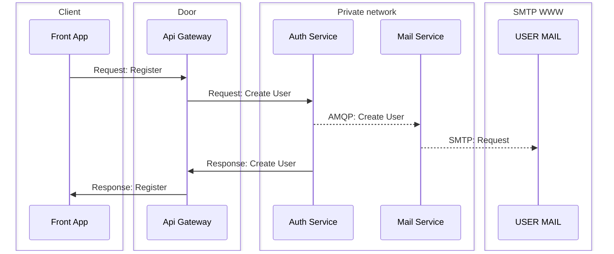
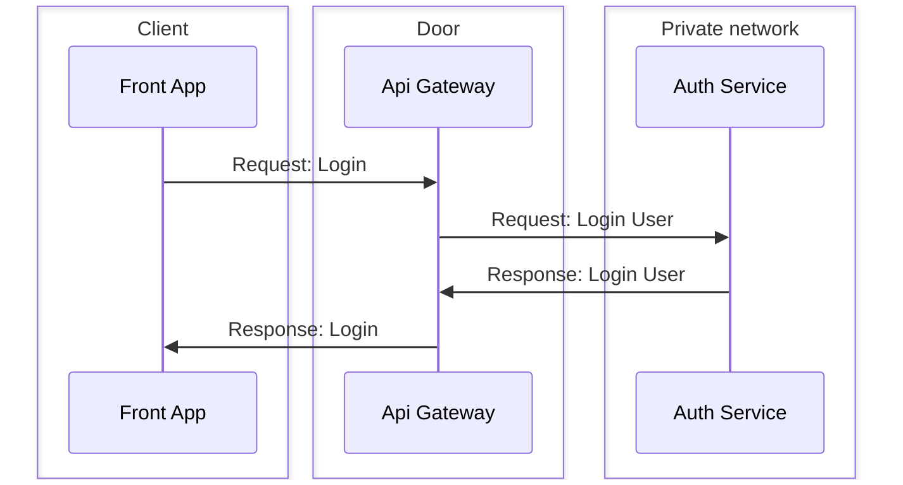
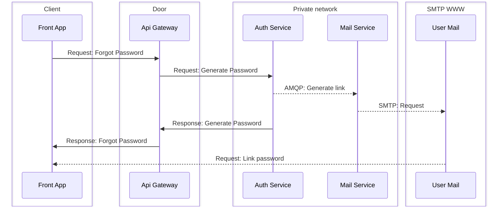

← [Retourner au sommaire] [summary]

# Authentication workflows  

## Register 

(Branche en cours de developpement au niveau de l'implementation AMQP: mette a jour quand terminé)

## Login

## Forgot password

(Branche en cours de developpement au niveau de l'implementation AMQP: mette a jour quand terminé)

[summary]: ../../README.md
