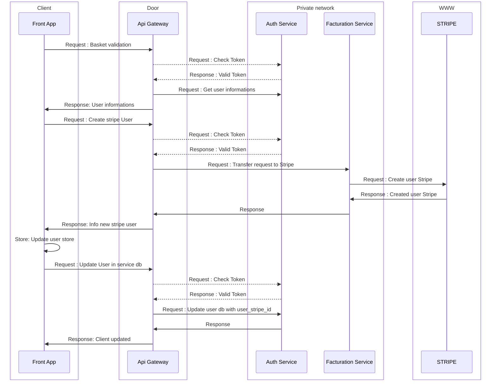
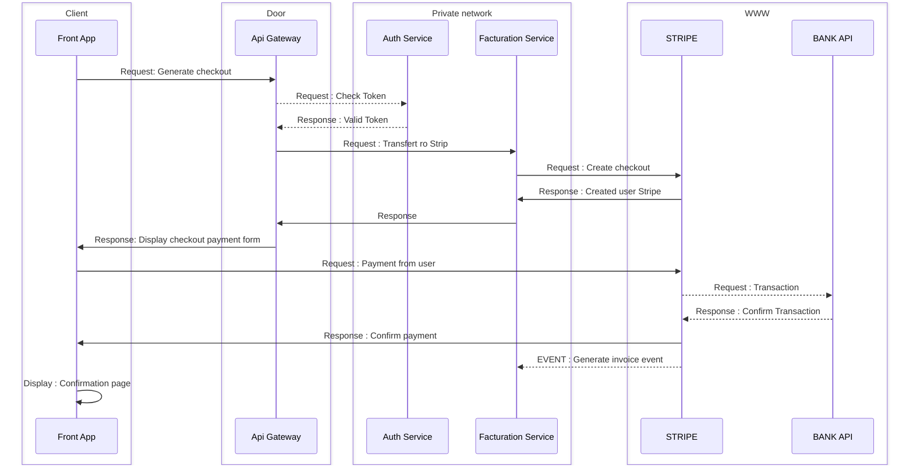

← [Retourner au sommaire] [summary]

# Facturation workflows

## Basket checking

- Lorsqu'un client souhaite valider son panier, il est possible que son user_stripe_id n'existe pas encore, notamment si c'est son premier achat. Dans ce cas, une première séquence de création sera effectuée.
- En revanche, si le client a déjà effectué un achat sur notre application, un user_stripe_id lui est fourni lors du login, et donc, au moment de valider le panier, la séquence mentionnée ci-dessus sera ignorée. Le processus passera directement à la facturation, comme décrit dans le point précédent.

## Facturation

- Dans le diagramme précédent, nous avons constaté qu'avant d'effectuer un paiement, il est nécessaire de s'assurer que le client possède un user_stripe_id pour pouvoir effectuer le paiement et exister au sein de Stripe.
- Le contrôle se fait lors du clic sur la validation du panier. Une fois que le client possède un user_stripe_id — qu'il soit nouvellement créé ou déjà existant — la validation nous redirige vers le composant Stripe, l'EmbededCheckout.
- Ce composant représente un formulaire de paiement dans lequel le client pourra enregistrer ses informations bancaires et autres données nécessaires pour procéder au paiement.

Voici le déroulé...

Comme précisé [ici][facturation-details], dans le titre Traitement des événements Stripe et persistance des factures, l'application n'étant pas encore en production, il est nécessaire, pour le moment, d'effectuer la persistance des factures via Postman afin de pouvoir consulter les factures.

[facturation-details]: ../../workflow/stripe/facturation.md
[summary]: ../../README.md
