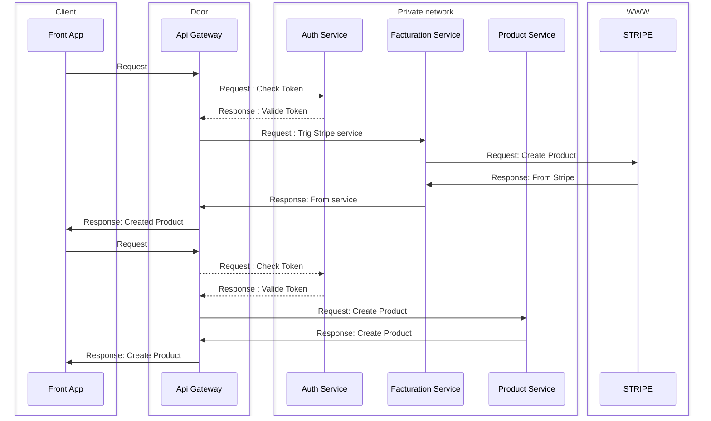

← [Retourner au sommaire] [summary]

# Product workflows

## Creation, modification & suppression

- La création est effectuée par un utilisateur SUPER_ADMIN et, dans le futur, un super job de type PRODUCT sera également créé. 
- L'API Gateway n'étant pas encore implémentée, pour le moment, c'est le front qui effectue les aller-retour entre les services.

[summary]: ../README.md
