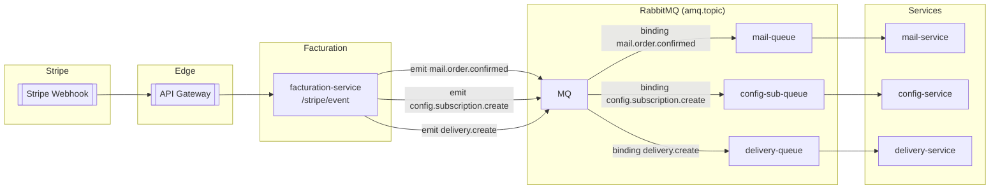
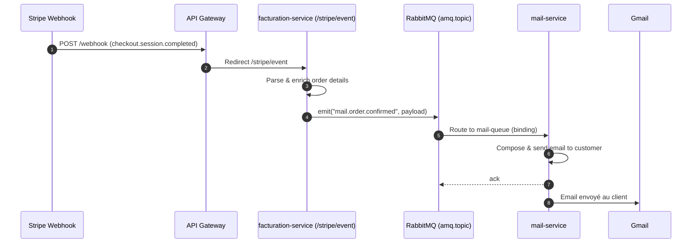
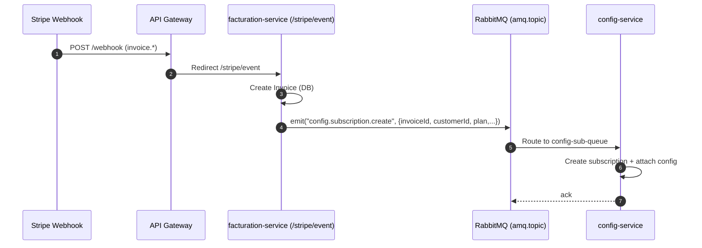
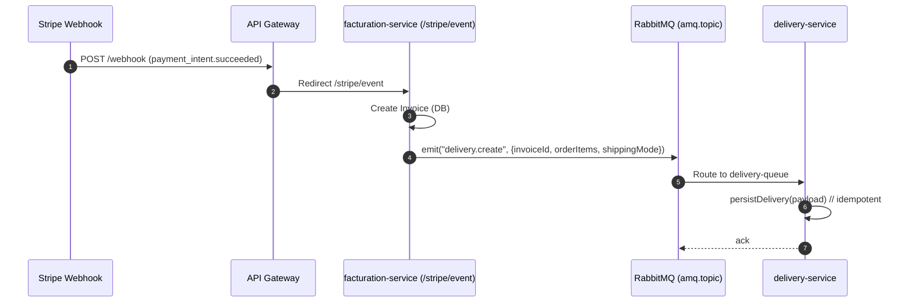

# Workflow Stripe → RabbitMQ (Events)

Cheminement des événements Stripe jusqu’aux microservices via RabbitMQ

---

## 1) Vue d’ensemble (architecture)

**Routing keys proposées** (cohérentes et explicites):

* `mail.order.confirmed` → `mail-queue`
* `config.subscription.create` → `config-sub-queue`
* `delivery.create` → `delivery-queue`

---

## 2) Décision côté facturation (/stripe/event)

Trois cas actuels (basés sur `body.object.object`):

* `checkout.session` → **Achat one‑shot (panier)**
  Action: émettre `mail.order.confirmed` (détails de commande dans l’email).
  **Point d’amélioration**: lorsque l’objet correspond à un **service**, enrichir le contenu pour afficher les détails aussi côté mail.

* `invoice` → **Abonnement (service)**
  Actions: créer la facture → émettre `config.subscription.create` (création de la subscription et de sa configuration côté `config-service`).

* `payment_intent` → **Achat produit**
  Actions: créer la facture → émettre `delivery.create` (création d’une ligne de livraison *click & collect* ou *point relais* dans l’admin).
  **À faire**: persister la livraison avec toutes les infos nécessaires (idempotence).

---

## 3) Séquences détaillées

### 3.1 `checkout.session` → e‑mail de confirmation

### 3.2 `invoice` → création d’abonnement + config

### 3.3 `payment_intent` → gestion de livraison

---

## 4) Spécifications RabbitMQ

**Exchange**: `amq.topic` (par défaut Nest)
**Queues**:

* `mail-queue` ← `mail.order.confirmed`
* `config-sub-queue` ← `config.subscription.create`
* `delivery-queue` ← `delivery.create`

**Paramètres recommandés côté consommateurs**:

* `noAck: false` (ack manuel pour fiabilité)
* `prefetchCount: 1` (back‑pressure)
* `queueOptions: { durable: true }`

**Idempotence**: inclure une clé unique (ex: `invoiceId`) et ignorer si déjà traité.

**Retry propre (DLX)**: éviter `requeue:true` infini, préférer DLX + TTL.

Etudier les *policy* (via UI ou `rabbitmqctl set_policy`) pour le DLX de `delivery-queue`:

> Idée: décliner des retries `5s`, `30s`, `2m`, puis une DLQ finale.

---

## 6) Payloads implementé

* `mail.order.confirmed`
  `{ orderId, customer: {email,name}, items: [{sku,qty,price}], total, isService }`

* `config.subscription.create`
  `{ invoiceId, subscriptionId?, customerId, plan: {code,period}, startsAt, meta }`

* `delivery.create`
  `{ invoiceId, orderId, items:[{sku,qty}], shippingMode: "click_collect"|"relay", relayInfo?, customer, notes? }`

---

## 7) Logs & observabilité

* **Corrélation**: propager `correlationId` depuis API Gateway → facturation → events.
* **Logs structurés** (JSON) avec niveau (`info|warn|error`) et `eventType`.
* **Métriques**: compteur d’événements par type, taux d’échec par handler, latence.
